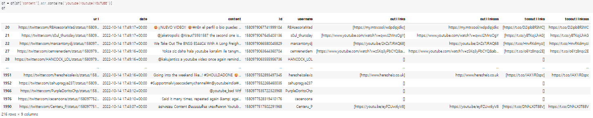
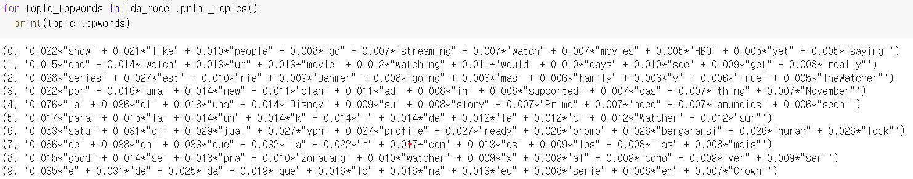

# Text Anakysis

##### **해당 코드는 서울대학교 빅데이터 혁신공유대학 Dr.야마다 아키히코님이 작성하신 코드를 바탕으로 클론코딩하였습니다.**

  

# Twitter 사용자들의 Youtube 와 Netflix에 대한 반응 비교

아래 뉴스기사를 접하고 Twitter 사용자들의 `Youtube`와 `Netflix`에 대한 반응을 비교해보았습니다.

 
 
해당 기사는 넷플릭스의 기존 요금제는 유지한 채 광고를 시청하고 콘텐츠를 시청할 수 있는 요금제가 추가하겠다는 내용입니다. `2022-10-14`에 업로드되었으며 Text Mining 및 Crawling을 실행한 날짜가 `2022-10-15`이므로  
검색 기간을 `2022-10-14 ~ 2022-10-15`로 한정하여 실행하였습니다.

- 좌측 이미지는 Youtube, 우측 이미지는 NetFlix에 대한 이미지입니다.
- `snscrape`을 사용하여 `SNS crawling`을 하였습니다.
- 이후 자세한 설명은 '-한다'로 작성할 것이므로 양해부탁드립니다.

### 검색 용어, 기간 설정
　　　 
- 검색하고 싶은 단어, 검색할 기간으로 설정한다.

### 검색할 결과 추출 개수 설정
 
- `Youtube`와 `Netflix` 둘다 2,000개의 검색결과를 추출한다.

### 검색된 결과 출력
　　　 
- DataFrame으로 변환하여 출력한다.

### 정확한 내용만 추출
　　　 
- username에 keyword가 있는 경우를 제외한다.

### 불요어
　　　 
 
　　　 
- 불요어란 필요하지 않은 단어이다.
- 불요어를 제외한다.

### 시각화
　　　 
- 자주 언급되거나 인기있는 단어를 한눈에 볼 수 있도록 시각화한다.
- 자주 사용될수록 크기가 크다.

### 감성 인식
　　　 
- 검색결과 중 내용이 긍정적인지 부정적인지 인식하고 퍼센트로 나타낸다.

### Text 분석
　　　 
- 검색된 단어의 빈도수를 나타낸다.

## 결과
　　　 
`좌측 - Youtube`　　　　　　　　　`우측 - Netflix`
- Twitter 사용자들의 Youtube에 대한 반응은 부정적인 인식이 높게 나왔지만 NetFlix의 부정적인 인식보다 약 10배 적게 나왔다.
- 앞에 소개한 기사와 같이 넷플릭스의 광고 에 대해 좋지 않은 인식이 강해진 것을 알 수 있다.
